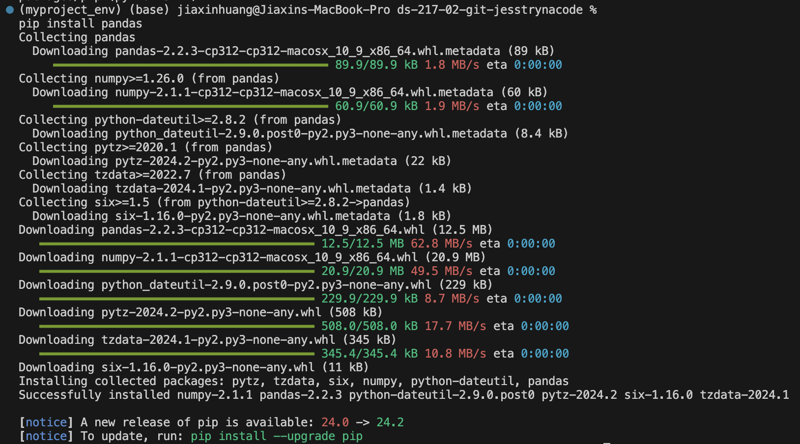

# Introduction

My name is Jess Huang. I am a pediatric critical care fellow and enrolled in the master's program for clinical research in the data science track. My research interest is in acute kidney injury (AKI) for critically ill children and specifically trying to understand factors that promote recovery from AKI as well as risk factors for progression to chronic kidney disease.

# Why Python
 I want to work with big data (i.e., EHR) to create prediction model and use machine learning techniques. I am familiar with R but have heard that python can be a very powerful tool for machine learning, which is why I am taking this class. I am hoping this class will give me the foundation and [Python](https://www.python.org/) proficiency to build common ML/AI solutions using python. 

 Speaking of AI, you mentioned you were interested in learning more about UCSF's secure generative AI platform, [Versa](https://ai.ucsf.edu/platforms-tools-and-resources/versa-chat-and-api).

# Screenshot of installing panda package

# Funny Meme about programming environment
