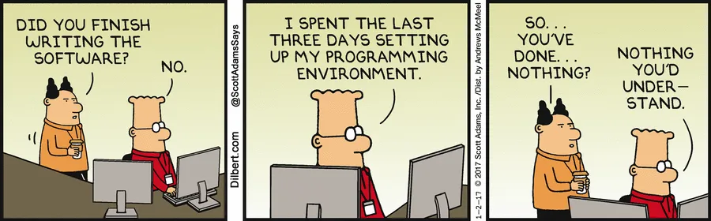

# Practical Exercise #1

1. Get everything installed (or use the cloud) and play around a bit
2. Create an account on GitHub 
    1. Apply for [GitHub Education](https://docs.github.com/en/education/explore-the-benefits-of-teaching-and-learning-with-github-education/github-education-for-students/apply-to-github-education-as-a-student)
    2. [Join the course and see next week's assignment](https://classroom.github.com/assignment-invitations/1e58c44840d34d542efc4c77c0ab0c2f/status)
3. Create a Python script that prints "Hello, Data Science!"
    1. Save it as hello_ds.py
    2. Run it from the command line
    3. Use command line to create a scripts folder and move your file into it
4. Write a Python script to solve the following:
    If we list all the natural numbers below 10 that are multiples of 3 or 5, we get (3, 5, 6, 9).
    The sum of these multiples is 23. Find the sum of all the multiples of 3 or 5 below 1000.
5. Email me:
    1. GitHub username
    2. Answer to the problem above + script you wrote to solve it
    3. Brief introduction (who are you, why are you here, anything you're specifically hoping to get out of the course)

For help, see the official Python [website](https://www.python.org/)

You mentioned you were interested in learning more about UCSF's secure generative AI platform, [Versa](https://ai.ucsf.edu/platforms-tools-and-resources/versa-chat-and-api).

## Screenshot of python installation

## Funny Meme on programming environment
